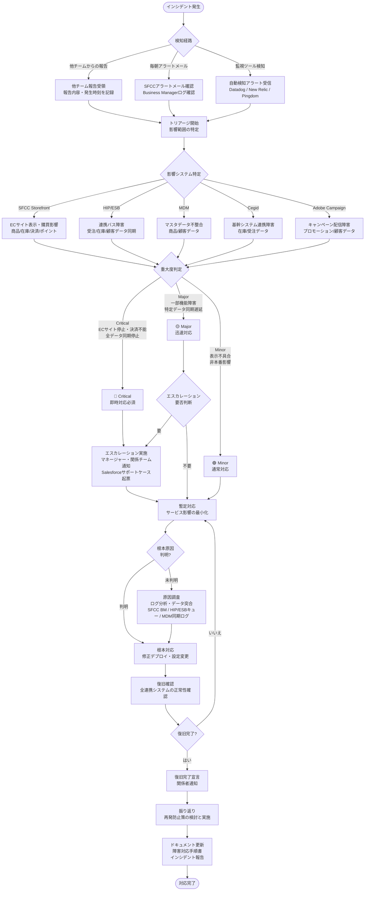

# インシデント対応フロー / Incident Response Flow

> SFCC連携システムにおけるインシデント対応の全体フロー、死活監視、性能監視を定義する。
> 対象システム: SFCC, HIP/ESB, MDM, Cegid, Adobe Campaign

---

## 目次

- [1. インシデント対応フロー図](#1-インシデント対応フロー図)
- [2. 影響範囲マトリクス](#2-影響範囲マトリクス)
- [3. 死活監視（ヘルスチェック）](#3-死活監視ヘルスチェック)
- [4. 性能監視（パフォーマンスモニタリング）](#4-性能監視パフォーマンスモニタリング)
- [5. エスカレーション連絡先](#5-エスカレーション連絡先)

---

## 1. インシデント対応フロー図

---

## 2. 影響範囲マトリクス

障害発生時にどのデータ種別が影響を受けるかの早見表。

| データ種別 | SFCC | HIP/ESB | MDM | Cegid | Adobe Campaign |
|---|:---:|:---:|:---:|:---:|:---:|
| 商品データ | ● | ● | ● | - | - |
| 在庫データ | ● | ● | - | ● | - |
| 受注データ | ● | ● | - | ● | - |
| 顧客データ | ● | ● | ● | - | ● |
| プロモーションデータ | ● | - | - | - | ● |
| 決済データ | ● | ● | - | - | - |
| ポイントデータ | ● | ● | - | ● | - |

● = 関連あり、- = 関連なし

---

## 3. 死活監視（ヘルスチェック）

### 3.1 監視対象一覧

| # | 監視対象 | エンドポイント/プロセス | 監視間隔 | アラート条件 | 推奨ツール |
|---|---|---|---|---|---|
| 1 | SFCC Storefront | ECサイトトップページ HTTP応答 | 1分 | 連続3回失敗 or レスポンス >5秒 | Pingdom, Datadog Synthetics |
| 2 | SFCC Business Manager | BM管理画面ログインページ応答 | 5分 | 連続2回失敗 or レスポンス >10秒 | Datadog Synthetics |
| 3 | SFCC ジョブ実行 | データインポート/エクスポートジョブ | 15分 | ジョブ失敗 or 実行時間閾値超過 | SFCC BMアラート, Datadog |
| 4 | HIP/ESB API | 連携APIヘルスチェックエンドポイント | 1分 | 連続3回失敗 or レスポンス >3秒 | Datadog, New Relic |
| 5 | HIP/ESB キュー | メッセージキュー滞留数 | 5分 | 滞留数 >1000件 or 増加傾向30分以上 | Datadog, CloudWatch |
| 6 | MDM 同期プロセス | マスタデータ同期バッチ | 15分 | 同期失敗 or 前回同期から >2時間経過 | Datadog, カスタム監視 |
| 7 | Cegid 連携 | 在庫/受注データ連携API | 5分 | 連続2回失敗 or レスポンス >5秒 | Datadog, New Relic |
| 8 | Adobe Campaign API | キャンペーン配信APIヘルスチェック | 5分 | 連続2回失敗 or レスポンス >5秒 | Datadog, Adobe Campaign自体の監視 |

### 3.2 アラート通知ルール

| 重大度 | 条件 | 通知方法 | 通知先 |
|---|---|---|---|
| Critical | Storefront停止 / 決済API停止 / HIP/ESB全面停止 | 電話 + Slack + メール | 運用チーム全員 + マネージャー |
| Major | 特定連携障害 / キュー滞留 / 同期遅延 | Slack + メール | 運用チーム + 担当者 |
| Minor | レスポンス遅延 / 非本番環境障害 | Slack | 担当者 |

---

## 4. 性能監視（パフォーマンスモニタリング）

### 4.1 監視メトリクス

| # | メトリクス | 対象システム | 正常範囲 | 警告閾値 | 危険閾値 | 推奨ツール |
|---|---|---|---|---|---|---|
| 1 | ページレスポンスタイム | SFCC Storefront | <2秒 | >3秒 | >5秒 | Datadog RUM, New Relic |
| 2 | サーバーレスポンスタイム | SFCC Storefront | <500ms | >1秒 | >3秒 | Datadog APM |
| 3 | HTTPエラーレート (5xx) | SFCC Storefront | <0.1% | >1% | >5% | Datadog, New Relic |
| 4 | API レスポンスタイム | HIP/ESB | <1秒 | >2秒 | >5秒 | Datadog APM, New Relic |
| 5 | キュー深度 | HIP/ESB | <100件 | >500件 | >1000件 | Datadog, CloudWatch |
| 6 | キュー処理速度 | HIP/ESB | >100件/分 | <50件/分 | <10件/分 | Datadog |
| 7 | データ同期遅延 | MDM → SFCC | <30分 | >1時間 | >2時間 | カスタム監視, Datadog |
| 8 | データ同期遅延 | Cegid → SFCC | <30分 | >1時間 | >2時間 | カスタム監視, Datadog |
| 9 | キャンペーン配信遅延 | Adobe Campaign | <15分 | >30分 | >1時間 | Adobe Campaign, Datadog |
| 10 | 受注処理件数 | SFCC → HIP/ESB | ベースライン ±30% | ベースライン ±50% | ベースライン ±80% | Datadog |
| 11 | CPU使用率 | 全システム | <60% | >75% | >90% | Datadog, New Relic |
| 12 | メモリ使用率 | 全システム | <70% | >80% | >95% | Datadog, New Relic |

### 4.2 ダッシュボード構成（推奨）

| ダッシュボード名 | 含むメトリクス | 用途 |
|---|---|---|
| SFCC Overview | ページレスポンス、エラーレート、受注件数 | 日常監視・朝会確認 |
| 連携システム状態 | HIP/ESBキュー深度、MDM/Cegid同期遅延 | データ連携の健全性確認 |
| インフラ状態 | CPU、メモリ、ディスク使用率 | リソース逼迫の早期検知 |
| キャンペーン配信 | Adobe Campaign配信状況、開封率 | プロモーション施策の効果確認 |

### 4.3 現状の検知経路との対比

| 検知経路 | 現状 | 改善後 |
|---|---|---|
| 他チームからの報告 | 受動的（発生後） | 監視ツールで能動的に先行検知 |
| 毎朝アラートメール | 1日1回（翌朝） | リアルタイムアラート（1〜5分間隔） |
| 監視ツール検知 | 未導入 | Datadog/New Relic等で24時間自動監視 |

---

## 5. エスカレーション連絡先

| 重大度 | 第一連絡先 | 第二連絡先 | 連絡手段 |
|---|---|---|---|
| Critical | 運用チームリーダー | マネージャー → Salesforceサポート | 電話 → Slack → メール |
| Major | 担当エンジニア | 運用チームリーダー | Slack → メール |
| Minor | 担当エンジニア | - | Slack |

> 具体的な連絡先は別途「障害対応手順書」を参照のこと。
