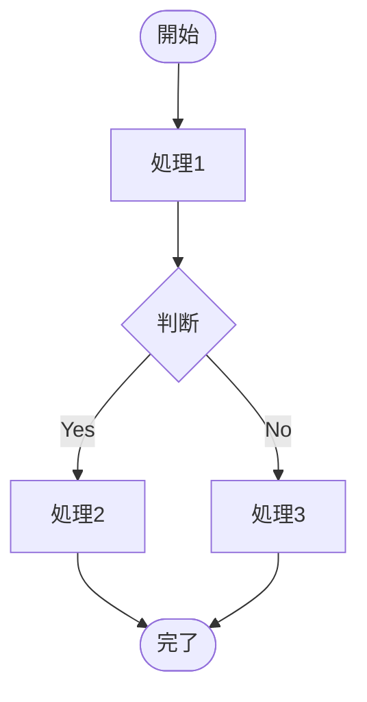
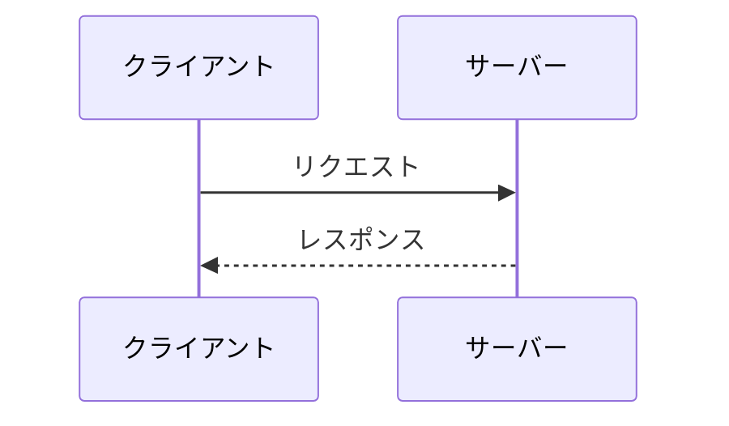
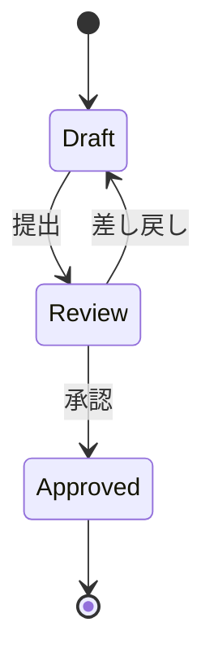
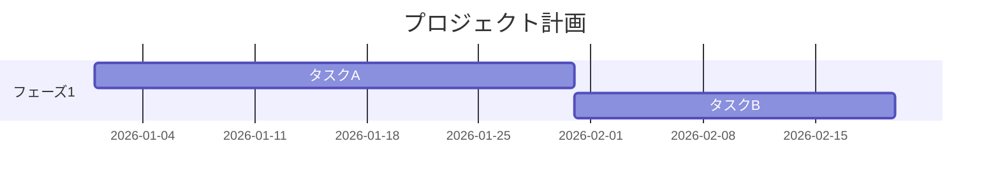
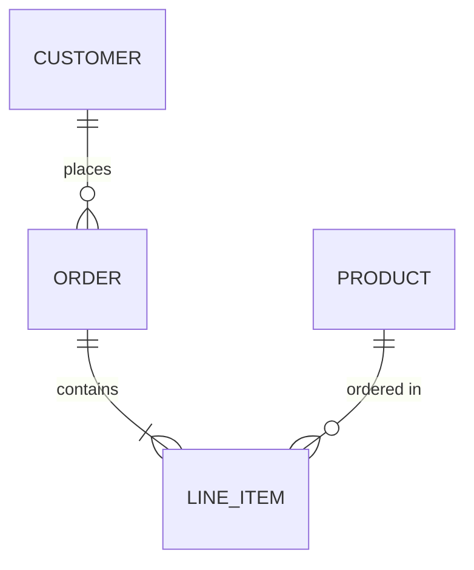
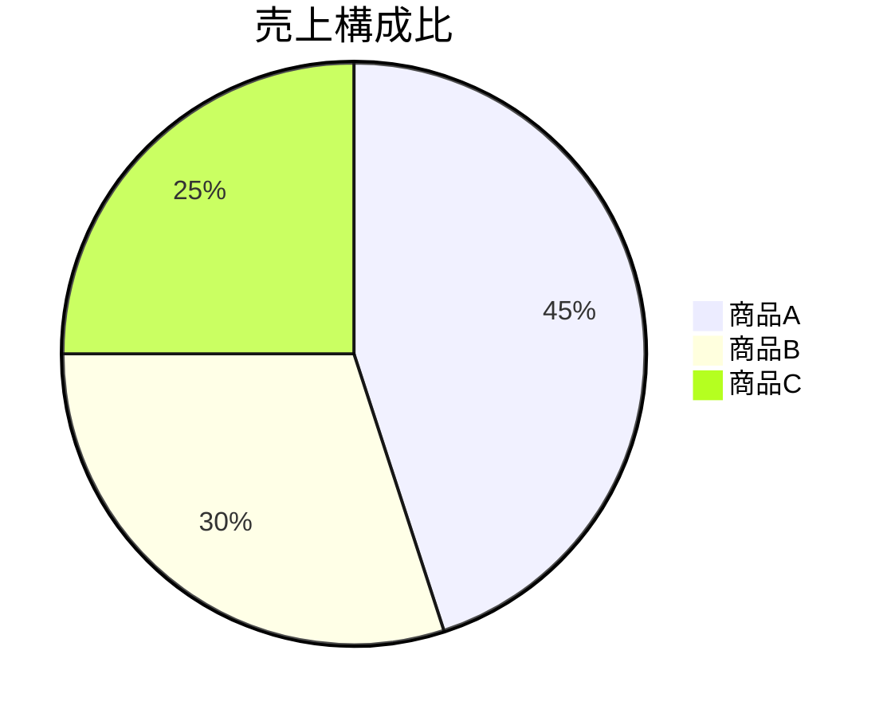
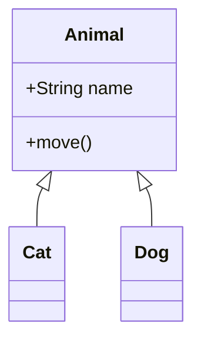

# Skill Design: mermaid-flow-generator

> **Version**: 1.0.0
> **Status**: Draft
> **Created**: 2026-01-29
> **Author**: ashigaru6
> **Origin**: cmd_011 実績 + 殿の汎用化方針

---

## 1. スキル概要

### 1.1 目的

任意のMarkdownドキュメントとシナリオ（目的・テーマ）を入力として受け取り、最適なMermaid図を含むMarkdownファイルを自動生成する汎用スキル。業務フロー、システム連携、状態遷移、プロジェクト計画など、あらゆるドメインの図表作成に対応する。

### 1.2 ユースケース

| ユースケース | 説明 | 推奨図タイプ |
|-------------|------|-------------|
| 業務フロー可視化 | 承認フロー、インシデント対応、オンボーディング等 | flowchart |
| システム間連携 | API呼び出しシーケンス、データ同期、認証フロー等 | sequence |
| 状態管理 | チケットライフサイクル、注文ステータス、デプロイ状態等 | state |
| プロジェクト計画 | スプリント計画、マイルストーン、リリーススケジュール等 | gantt |
| データモデル | テーブル関係、エンティティ設計、スキーマ定義等 | er |
| 統計・分布 | 割合、カテゴリ分布、アンケート結果等 | pie |
| アーキテクチャ | クラス構造、コンポーネント関係、レイヤー構成等 | class |

### 1.3 背景

本スキルは cmd_011（インシデント対応フロー図作成）での実績を汎用化したものである。cmd_011 では observations.md の知見から Mermaid flowchart を含む177行のドキュメントを生成した。この手法を特定ドメインに依存しない汎用ツールとして再設計する。

---

## 2. 入力パラメータ

### 2.1 必須パラメータ

| パラメータ | 型 | 説明 |
|-----------|-----|------|
| `scenario` | String | フロー図の目的・テーマ。何を可視化したいかの説明 |
| `output_file` | String | 出力先Markdownファイルパス |

### 2.2 オプションパラメータ

| パラメータ | 型 | デフォルト | 説明 |
|-----------|-----|-----------|------|
| `source_files` | List[String] | `[]` | 入力Markdownファイル群。図の内容の元となる情報源 |
| `diagram_type` | Enum | `auto` | 図タイプ: `auto`, `flowchart`, `sequence`, `state`, `gantt`, `er`, `pie`, `class` |
| `language` | String | `auto` | 出力言語。`auto` の場合は入力テキストの言語に合わせる |
| `include_supplementary_text` | Boolean | `true` | 図の前後に補足テキスト（説明、凡例、表等）も生成するか |

### 2.3 diagram_type: auto の選択ロジック

`auto` が指定された場合、scenario と source_files の内容から最適な図タイプを自動選択する。

| 判定キーワード / パターン | 選択される図タイプ |
|--------------------------|-------------------|
| フロー、手順、プロセス、承認、対応、判断分岐 | flowchart |
| API、リクエスト、レスポンス、呼び出し、連携、通信 | sequence |
| 状態、ステータス、遷移、ライフサイクル、ステージ | state |
| 計画、スケジュール、タイムライン、マイルストーン、期間 | gantt |
| テーブル、エンティティ、リレーション、スキーマ、外部キー | er |
| 割合、比率、分布、パーセント、構成比 | pie |
| クラス、継承、インターフェース、コンポーネント、レイヤー | class |

複数のキーワードが該当する場合は、最も多くヒットした図タイプを選択する。同数の場合は flowchart をデフォルトとする。

### 2.4 入力例

```yaml
# Example 1: インシデント対応フロー
scenario: "SFCC連携システムにおけるインシデント対応フローの可視化。検知→トリアージ→対応→復旧→振り返りの全工程"
source_files:
  - "docs/observations.md"
output_file: "docs/incident_response_flow.md"
diagram_type: auto
language: ja
include_supplementary_text: true
```

```yaml
# Example 2: デプロイフロー
scenario: "CI/CDパイプラインのデプロイフロー。PR作成からプロダクション反映まで"
source_files: []
output_file: "docs/deploy_flow.md"
diagram_type: flowchart
language: en
include_supplementary_text: true
```

```yaml
# Example 3: データモデル
scenario: "ECサイトの受注データモデル。注文、商品、顧客、決済の関係を可視化"
source_files:
  - "docs/database_design.md"
output_file: "docs/order_er_diagram.md"
diagram_type: er
language: ja
include_supplementary_text: false
```

---

## 3. 出力フォーマット

### 3.1 基本構造

出力は以下の構造を持つMarkdownファイルである。

```markdown
# {タイトル}

> {概要説明（1-2文）}

---

## {セクション見出し（図の説明）}

（補足テキスト: include_supplementary_text=true の場合）

{Mermaidコードブロック}

---

（補足セクション: include_supplementary_text=true の場合）
## {補足セクション1}
{表、リスト、説明等}

## {補足セクション2}
...
```

### 3.2 Mermaid図の記法

各図タイプの基本記法：

**flowchart:**


**sequence:**


**state:**


**gantt:**


**er:**


**pie:**


**class:**


### 3.3 補足テキストの種類

`include_supplementary_text: true` の場合、図タイプに応じた補足を生成する。

| 図タイプ | 生成される補足 |
|---------|--------------|
| flowchart | 各フェーズの説明、判断基準の表、関連リソース |
| sequence | API仕様の要約、エラーケースの補足、リトライポリシー |
| state | 状態一覧と説明、遷移条件の表、無効な遷移の注記 |
| gantt | マイルストーン説明、依存関係の注記、リスク事項 |
| er | エンティティ説明、カーディナリティの凡例、インデックス推奨 |
| pie | データソース、集計条件、注意事項 |
| class | 設計方針、責務の説明、拡張ポイント |

---

## 4. 処理フェーズ詳細

### Phase 1: 入力Markdown読み込み・内容把握

```
1. source_files が指定されている場合、各ファイルを Read で読み込む
2. 入力テキストの言語を検出（日本語/英語/その他）
3. キーポイントを抽出:
   - 登場するエンティティ（人、システム、プロセス等）
   - 関係性やフロー（AがBに送る、CからDへ遷移する等）
   - 条件分岐（もし〜なら、〜の場合等）
   - 数値データ（割合、件数、期間等）
4. scenario の内容を解析し、図に含めるべき要素を特定
```

### Phase 2: シナリオに基づくフロー構造の設計

```
1. Phase 1 で抽出した要素から図の骨格を設計:
   - ノード（プロセス、状態、エンティティ等）の洗い出し
   - エッジ（遷移、関係、メッセージ等）の定義
   - グループ化（フェーズ、サブグラフ、セクション等）
2. 情報の優先度を判断:
   - 主要フロー（メインパス）
   - 代替フロー（エラー、例外、分岐）
   - 補足情報（注記、凡例）
3. 図の複雑度を制御:
   - ノード数が20を超える場合はサブグラフで分割
   - エッジが交差しすぎる場合はレイアウト方向を調整（TD/LR）
```

### Phase 3: 最適なMermaid図タイプの選択

```
1. diagram_type が auto の場合:
   a. scenario + source_files のテキストからキーワードを抽出
   b. セクション2.3の判定表に基づいてスコアリング
   c. 最高スコアの図タイプを選択
   d. 選択理由をコメントとして記録
2. diagram_type が明示されている場合:
   a. 指定された図タイプを使用
   b. 入力内容との適合性を確認（不適合の場合は警告を出力）
```

### Phase 4: Mermaid記法でのフロー図生成

```
1. 選択された図タイプの記法に従いMermaidコードを生成
2. ノードIDの命名規則:
   - 大文字スネークケース（STEP_NAME）
   - 意味のある名前を使用（STEP1, STEP2 ではなく DETECT, TRIAGE 等）
3. ラベルの記述:
   - 簡潔だが意味が通る表現
   - 改行が必要な場合は <br/> を使用
4. スタイリング:
   - 開始/終了ノード: ([ラベル])
   - 処理ノード: [ラベル]
   - 判断ノード: {ラベル}
   - サブルーチン: [[ラベル]]
5. コメントの挿入:
   - %% でフェーズ区切りを明示
   - 複雑な分岐にはコメントで意図を補足
6. GitHub上でのMermaid描画を前提とした記法を使用:
   - GitHub がサポートする Mermaid バージョンの機能のみ使用
   - 実験的機能やプラグイン依存の記法は避ける
```

### Phase 5: 補足テキスト生成

```
1. include_supplementary_text が true の場合:
   a. 図の前に概要説明を生成（目的、対象読者、前提条件）
   b. 図の後に補足セクションを生成（セクション3.3参照）
   c. 必要に応じて表（Markdown table）を挿入
   d. 目次（TOC）が有用な場合は先頭に追加
2. include_supplementary_text が false の場合:
   a. 最小限のタイトルと概要のみ
   b. Mermaidコードブロックを出力
```

### Phase 6: Markdown出力ファイル生成

```
1. 全セクションを結合してMarkdownファイルを構成
2. 出力ファイルを Write で生成
3. 生成後の確認:
   a. Mermaidコードブロックが正しく```mermaid で囲まれているか
   b. Markdownの見出しレベルが適切か
   c. 表のカラム揃えが正しいか
   d. 内部リンク（アンカー）が有効か
```

---

## 5. 対応するMermaid図の種類と使い分け

### 5.1 図タイプ一覧

| 図タイプ | Mermaid キーワード | 主な用途 | 適したデータ |
|---------|-------------------|---------|-------------|
| flowchart | `flowchart TD/LR` | 業務フロー、意思決定、手順書 | プロセス、判断分岐、並列処理 |
| sequence | `sequenceDiagram` | システム間通信、API連携 | メッセージ、リクエスト/レスポンス |
| state | `stateDiagram-v2` | 状態遷移、ライフサイクル | 状態、イベント、遷移条件 |
| gantt | `gantt` | プロジェクト計画、スケジュール | タスク、期間、依存関係 |
| er | `erDiagram` | データモデル、DB設計 | エンティティ、リレーション、属性 |
| pie | `pie` | 統計、割合、分布 | カテゴリ、数値 |
| class | `classDiagram` | 設計、アーキテクチャ | クラス、継承、関連 |

### 5.2 レイアウト方向の選択（flowchart）

| 方向 | 記法 | 適したケース |
|------|------|-------------|
| 上から下 | `TD` | 時系列フロー、階層構造、インシデント対応 |
| 左から右 | `LR` | パイプライン、データフロー、横長の手順 |

ノード数が10以下の場合は `LR`、10を超える場合は `TD` を推奨。

---

## 6. Examples

### 6.1 インシデント対応フロー（cmd_011 実績ベース）

**入力:**
```yaml
scenario: "SFCC連携システムのインシデント対応フロー。検知→トリアージ→重大度判定→対応→復旧→振り返りの全工程"
source_files: ["docs/observations.md"]
output_file: "docs/incident_response_flow.md"
diagram_type: auto  # → flowchart が自動選択される
language: ja
include_supplementary_text: true
```

**出力（抜粋）:**
- flowchart TD 形式のMermaid図（検知フェーズ→トリアージ→重大度判定→エスカレーション→対応→復旧→振り返り）
- 補足: 影響範囲マトリクス（データ種別×システムの表）、死活監視一覧、性能監視メトリクス、エスカレーション連絡先

**実績:**
- commit 0682982 で177行のドキュメントを生成
- 6フェーズ、5システム分岐、3重大度レベルを含むフローチャート
- cmd_012 で殿フィードバック反映（トリアージ順序修正）

### 6.2 CI/CDデプロイフロー

**入力:**
```yaml
scenario: "GitHub ActionsベースのCI/CDデプロイフロー。PR作成からプロダクションデプロイまでの全工程"
source_files: []
output_file: "docs/deploy_flow.md"
diagram_type: flowchart
language: en
include_supplementary_text: true
```

**出力（期待例）:**
```markdown
# CI/CD Deploy Flow

> Deployment pipeline from PR creation to production release using GitHub Actions.

---

## Deploy Flow Diagram

｀｀｀mermaid
flowchart TD
    PR([PR Created]) --> LINT[Lint & Format Check]
    LINT --> TEST[Unit Tests]
    TEST --> BUILD[Build Artifacts]
    BUILD --> REVIEW{Code Review}
    REVIEW -->|Approved| MERGE[Merge to main]
    REVIEW -->|Changes Requested| PR
    MERGE --> STAGING_DEPLOY[Deploy to Staging]
    STAGING_DEPLOY --> E2E[E2E Tests]
    E2E --> E2E_CHECK{E2E Passed?}
    E2E_CHECK -->|Yes| PROD_APPROVAL{Production Approval}
    E2E_CHECK -->|No| ROLLBACK_STG[Rollback Staging]
    ROLLBACK_STG --> PR
    PROD_APPROVAL -->|Approved| PROD_DEPLOY[Deploy to Production]
    PROD_APPROVAL -->|Rejected| HOTFIX[Create Hotfix]
    HOTFIX --> PR
    PROD_DEPLOY --> SMOKE[Smoke Tests]
    SMOKE --> SMOKE_CHECK{Smoke Passed?}
    SMOKE_CHECK -->|Yes| DONE([Deploy Complete])
    SMOKE_CHECK -->|No| ROLLBACK_PROD[Rollback Production]
    ROLLBACK_PROD --> HOTFIX
｀｀｀

---

## Pipeline Stages

| Stage | Trigger | Duration | Failure Action |
|-------|---------|----------|----------------|
| Lint & Format | PR push | ~2 min | Block merge |
| Unit Tests | PR push | ~5 min | Block merge |
| Build | PR push | ~3 min | Block merge |
| Staging Deploy | Merge to main | ~5 min | Alert team |
| E2E Tests | Post-staging | ~15 min | Rollback staging |
| Production Deploy | Manual approval | ~5 min | Alert on-call |
| Smoke Tests | Post-production | ~3 min | Auto-rollback |
```

### 6.3 注文ステータス遷移

**入力:**
```yaml
scenario: "ECサイト注文のステータス遷移図。注文作成から完了・キャンセルまでの全状態を網羅"
source_files: []
output_file: "docs/order_state_diagram.md"
diagram_type: state
language: ja
include_supplementary_text: true
```

**出力（期待例）:**
```markdown
# 注文ステータス遷移図

> ECサイトにおける注文の全ライフサイクルを状態遷移図で表現する。

---

## 遷移図

｀｀｀mermaid
stateDiagram-v2
    [*] --> 注文作成
    注文作成 --> 決済待ち: 注文確定
    決済待ち --> 決済完了: 決済成功
    決済待ち --> 決済失敗: 決済エラー
    決済失敗 --> 決済待ち: リトライ
    決済失敗 --> キャンセル: 3回失敗
    決済完了 --> 出荷準備: 在庫引当OK
    決済完了 --> 在庫不足: 在庫引当NG
    在庫不足 --> キャンセル: 入荷未定
    在庫不足 --> 出荷準備: 入荷完了
    出荷準備 --> 出荷済み: 配送業者引渡
    出荷済み --> 配達完了: 受領確認
    出荷済み --> 返品受付: 返品申請
    配達完了 --> 返品受付: 返品申請(期間内)
    返品受付 --> 返金処理: 返品確認
    返金処理 --> 完了: 返金実行
    配達完了 --> 完了: 返品期間経過
    キャンセル --> [*]
    完了 --> [*]
｀｀｀

---

## 状態一覧

| 状態 | 説明 | 次の遷移先 |
|------|------|-----------|
| 注文作成 | カートから注文が生成された初期状態 | 決済待ち |
| 決済待ち | 決済処理の完了を待機中 | 決済完了、決済失敗 |
| 決済完了 | 決済が正常に完了 | 出荷準備、在庫不足 |
| 出荷準備 | 倉庫でピッキング・梱包中 | 出荷済み |
| 出荷済み | 配送業者に引き渡し済み | 配達完了、返品受付 |
| 配達完了 | 購入者が受領 | 完了、返品受付 |
| キャンセル | 注文がキャンセルされた終了状態 | （終了） |
| 完了 | 全処理が正常に終了 | （終了） |
```

### 6.4 APIシーケンス図

**入力:**
```yaml
scenario: "OAuth2.0認証フローのシーケンス図。Authorization Code Grantの全ステップ"
source_files: []
output_file: "docs/oauth2_sequence.md"
diagram_type: sequence
language: en
include_supplementary_text: true
```

**出力（期待例）:**
```markdown
# OAuth 2.0 Authorization Code Flow

> Complete sequence diagram for OAuth 2.0 Authorization Code Grant.

---

## Sequence Diagram

｀｀｀mermaid
sequenceDiagram
    participant U as User
    participant C as Client App
    participant A as Auth Server
    participant R as Resource Server

    U->>C: Access protected resource
    C->>A: Redirect to /authorize
    A->>U: Show login page
    U->>A: Enter credentials
    A->>C: Redirect with auth code
    C->>A: POST /token (code + client_secret)
    A-->>C: Access token + Refresh token
    C->>R: GET /resource (Bearer token)
    R-->>C: Protected resource data
    C-->>U: Display resource

    Note over C,A: Token expires after 1 hour
    C->>A: POST /token (refresh_token)
    A-->>C: New access token
｀｀｀
```

---

## 7. 制限事項

### 7.1 技術的制限

| 制限 | 説明 | 回避策 |
|-----|------|--------|
| GitHub Mermaid対応範囲 | GitHubが対応していないMermaid機能は描画されない | GitHub公式ドキュメントで対応状況を確認 |
| 図の複雑度 | ノード数50超やエッジ数100超は描画が崩れる可能性 | サブグラフで分割、複数の図に分離 |
| 日本語ノード名 | 一部の記号や長い日本語でレイアウトが崩れる場合あり | ノードIDは英語、ラベルのみ日本語にする |
| インタラクティブ機能 | クリックイベント等のインタラクティブ機能はGitHubでは動作しない | 静的な図として設計 |
| スタイリング | GitHub上ではカスタムCSSやテーマの適用が制限される | Mermaid組み込みのスタイル指定のみ使用 |
| 自動レイアウト | ノード配置はMermaidエンジン任せ。意図通りにならない場合がある | ノードの記述順序を調整して制御 |

### 7.2 前提条件

- 出力先がGitHub上でMermaidが描画される環境であること（GitHub.com, GitHub Enterprise）
- 入力Markdownが構造化されたテキストであること（箇条書き、見出し、表等）
- scenario が図の目的を十分に記述していること

### 7.3 精度について

- source_files の内容が曖昧な場合、生成される図の精度が低下する
- 自動図タイプ選択（auto）は keyword-based であり、文脈を完全に理解するものではない
- 複雑なビジネスロジックは単一の図で表現しきれない場合がある

---

## 8. 将来の拡張案

| 優先度 | 拡張案 | 説明 |
|--------|--------|------|
| high | 複数図タイプ出力 | 1つの scenario から複数の図（例: flowchart + sequence）を生成 |
| high | 既存図の更新モード | 既存のMermaid図を含むMarkdownを読み込み、差分更新 |
| medium | PlantUML出力 | Mermaid以外の図記法への変換 |
| medium | 図のバリデーション | 生成されたMermaid記法の構文チェック |
| medium | テンプレートライブラリ | よく使うフローパターンのテンプレート集 |
| low | SVG/PNG直接出力 | Mermaid CLIを使用した画像ファイル生成 |
| low | diff可視化 | 2つの図の差分をハイライト表示 |

---

## 9. 実績データ（cmd_011 からの知見）

本スキルの設計は cmd_011（インシデント対応フロー図作成）の実績に基づく。

### 9.1 生成結果

| 指標 | 値 |
|------|-----|
| 入力ファイル | docs/observations.md（1ファイル） |
| 出力ファイル | docs/incident_response_flow.md（177行） |
| 図タイプ | flowchart TD |
| ノード数 | 約30 |
| フェーズ数 | 6（検知→トリアージ→観察→分析→対応→復旧→振り返り） |
| 補足セクション | 影響範囲マトリクス、死活監視、性能監視、エスカレーション連絡先 |
| commit | 0682982（初版）、7eb397e（トリアージ順序修正） |

### 9.2 学んだ知見

- フローチャートのフェーズ区切りには `%% === フェーズ名 ===` コメントが有効
- ノードIDは英語大文字、ラベルは入力言語に合わせるのが最も読みやすい
- 判断ノード後の分岐ラベルには `|ラベル|` を使い、条件を明示する
- 補足テキスト（表、チェックリスト）は図と同等以上の情報量を持つ場合がある
- フィードバック反映（cmd_012）で「観察→分析→特定」の順序が重要と判明。フロー設計時はドメインエキスパートの視点を考慮すべき

---

## 10. 参考資料

- [Mermaid 公式ドキュメント](https://mermaid.js.org/intro/)
- [GitHub Mermaid サポート](https://docs.github.com/en/get-started/writing-on-github/working-with-advanced-formatting/creating-diagrams)
- cmd_011 成果物: `docs/incident_response_flow.md`
- cmd_012 修正: トリアージ順序フィードバック反映
